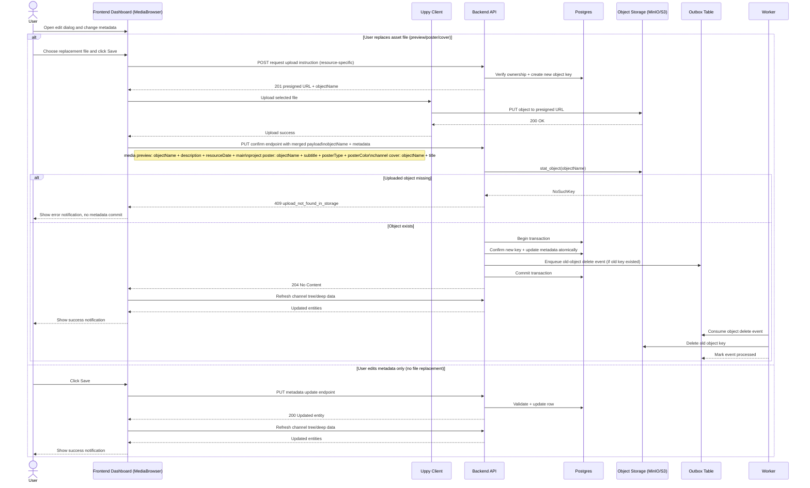

# Edit Flow Sequence Diagram (Atomic Confirm + Metadata)

```mermaid
sequenceDiagram
    actor U as User
    participant FE as Frontend Dashboard (MediaBrowser)
    participant UPPY as Uppy Client
    participant API as Backend API
    participant DB as Postgres
    participant S3 as Object Storage (MinIO/S3)
    participant OUT as Outbox Table
    participant WRK as Worker

    U->>FE: Open edit dialog and change metadata

    alt User replaces asset file (preview/poster/cover)
        U->>FE: Choose replacement file and click Save
        FE->>API: POST request upload instruction (resource-specific)
        API->>DB: Verify ownership + create new object key
        API-->>FE: 201 presigned URL + objectName

        FE->>UPPY: Upload selected file
        UPPY->>S3: PUT object to presigned URL
        S3-->>UPPY: 200 OK
        UPPY-->>FE: Upload success

        FE->>API: PUT confirm endpoint with merged payload\nobjectName + metadata
        Note right of FE: media preview: objectName + description + resourceDate + main\nproject poster: objectName + subtitle + posterType + posterColor\nchannel cover: objectName + title

        API->>S3: stat_object(objectName)
        alt Uploaded object missing
            S3-->>API: NoSuchKey
            API-->>FE: 409 upload_not_found_in_storage
            FE-->>U: Show error notification, no metadata commit
        else Object exists
            API->>DB: Begin transaction
            API->>DB: Confirm new key + update metadata atomically
            API->>OUT: Enqueue old-object delete event (if old key existed)
            API->>DB: Commit transaction
            API-->>FE: 204 No Content
            FE->>API: Refresh channel tree/deep data
            API-->>FE: Updated entities
            FE-->>U: Show success notification

            WRK->>OUT: Consume object delete event
            WRK->>S3: Delete old object key
            WRK-->>OUT: Mark event processed
        end
    else User edits metadata only (no file replacement)
        U->>FE: Click Save
        FE->>API: PUT metadata update endpoint
        API->>DB: Validate + update row
        API-->>FE: 200 Updated entity
        FE->>API: Refresh channel tree/deep data
        API-->>FE: Updated entities
        FE-->>U: Show success notification
    end
```
