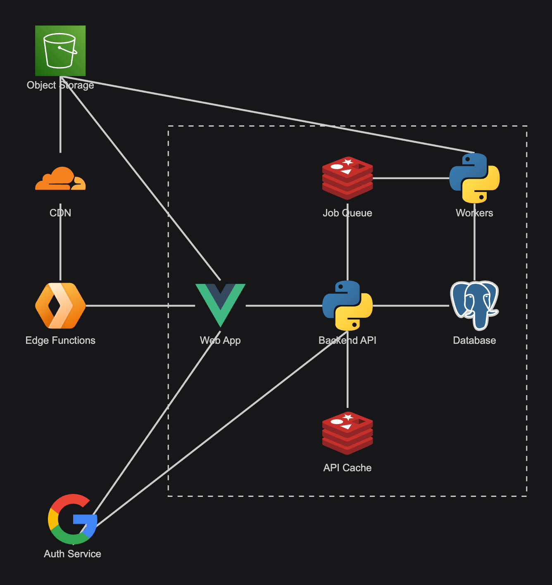

# Fotrino Films


Fotrino Films is a video content hosting platform. It is designed for users to be able to upload content and share it easily with family and friends. It is not designed for monetisation or content discovery.

This project is actively being developed and is not yet ready for use.

## [Demo Site](https://films.fotrino.com/)

[](https://hstspreload.org/?domain=films.fotrino.com)
[](https://www.ssllabs.com/ssltest/analyze.html?d=films.fotrino.com)
[](https://observatory.mozilla.org/analyze/films.fotrino.com)

Note that I regularly delete the DB and content so please don't upload important files.

## Architecture



### Frontend

- The frontend is an [SPA](https://en.wikipedia.org/wiki/Single-page_application) built with [Quasar](https://quasar.dev/), a framework based on [Vue](https://vuejs.org/).

### Authentication

- All authentication is handled by external identity providers (currently GitHub, Google, and Microsoft). The session is stateless: when a user logs in, an encrypted cookie is stored on the client, without storing any secrets on the backend that could be hacked or leaked.

### Backend

- A [Python Flask](https://flask.palletsprojects.com/en/stable/) service exposes the main API which persists data to a [Postgres DB](https://www.postgresql.org/docs/current/index.html). Most `GET` requests are cached in [Redis](https://redis.io/docs/latest/).
- The backend is stored in a private repo that is not open source.

### Uploads

- To avoid blocking backend threads with long-running uploads, files are uploaded directly to a private S3 bucket
 via [presigned URLs](https://docs.aws.amazon.com/AmazonS3/latest/userguide/using-presigned-url.html).
- Currently, uploads have a maximum file size limit and cannot be resumed. Multipart uploads will be implemented to solve this problem in the future.

### Media Processing

- Media that is uploaded must first be transformed into an [HLS stream](https://en.wikipedia.org/wiki/HTTP_Live_Streaming) before it can be made available.
- This is an async process. Jobs are published using [RQ](https://python-rq.org/) for workers to consume.
- Each worker is responsible for:
  - Downloading the original file
  - Transforming it to HLS using code based on Vincent Bernat's [video2hls](https://github.com/vincentbernat/video2hls) tool which itself uses [ffmpeg](https://ffmpeg.org/)
  - Uploading each segment back to the bucket
  - Publishing the media and sending a notification to the uploader.
- If an error occurs, work is retried with an exponetial backoff. After exhausting retries, a [DLQ](https://en.wikipedia.org/wiki/Dead_letter_queue) message is created.

### Streaming

- All media is served from a private bucket behind a global [CDN](https://www.cloudflare.com/en-gb/).
- To request a video segment, a [JWT](https://en.wikipedia.org/wiki/JSON_Web_Token) (provided by the backend API) must be provided.
- The JWT is validated by an [Edge Function](https://developers.cloudflare.com/workers/reference/how-workers-works/) which will either serve the segment from cache or add authentication headers and fetch the segment from the origin.

### Testing

- End to end tests written in [Cypress](https://www.cypress.io/) are in a private repo and not open source.

## Development

[](https://sonarcloud.io/dashboard?id=michaelmolino_fotrino-films-frontend)
[](https://pagespeed.web.dev/analysis/https-films-fotrino-com-9944fa03-8a73-4e52-84bc-e8a514bd1271-Sample-Channel-Nature-Majestic-Mountains/qoi6uczygb?hl=en-GB&form_factor=mobile)
[](https://pagespeed.web.dev/analysis/https-films-fotrino-com-9944fa03-8a73-4e52-84bc-e8a514bd1271-Sample-Channel-Nature-Majestic-Mountains/qoi6uczygb?hl=en-GB&form_factor=mobile)

### Dependencies

```bash
yarn install
yarn global add @quasar/cli
```

### Run

```bash
quasar dev
```

Note: You'll need to proxy the backend somewhere in `quasar.config.js`.
