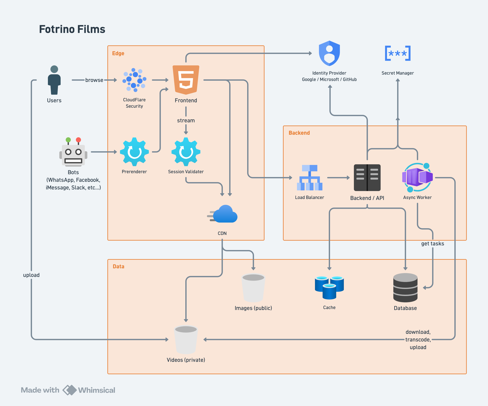

# Fotrino Films

Fotrino Films is a personal video hosting platform built for private sharing with family and friends. There are no trackers, no pushy discovery algorithms, and no annoying ads or overlays. If most platforms are designed to pay you for content, this one is designed for you to pay for hosting.

## Project Status

This project is under active development and should be considered pre-production.

## Demo

The demo runs on a small deployment for evaluation purposes. It is not representative of production scale or performance characteristics. The service may be intermittently unavailable due to maintenance, resets, or resource constraints.

## Architecture & Development

### Public Components

- Frontend - This repository, a single-page application built with [Quasar](https://www.quasar.dev/) (Vue).

  

### Private Components

- Backend
  - API - A [Flask](https://flask.palletsprojects.com/en/stable/) (Python) application.

    

  - Async Worker - Runs asynchronous media workflows (transcoding, HLS packaging, image conversion, and deletion) with [Procrastinate](https://procrastinate.readthedocs.io/en/stable/index.html) and [ffmpeg](https://ffmpeg.org/). Jobs are persisted in Postgres rather than an external queue, a deliberate architectural choice for reliability and operational simplicity.

- Cypress Tests - End-to-end tests covering key user journeys.
- Infrastructure
  - Prerenderer - Serves prerendered pages with metadata for bots that do not execute JavaScript (mostly so link previews work).
  - Session Validator - Ensures users have a valid media session before serving assets from a private bucket.
  - Terraform - All infrastructure is deployed via Terraform.
  - Environment Variables (no secrets) - Required production environment variables.

## AI Usage

Fotrino is built by a human, with AI used as a development tool.

I use AI to brainstorm ideas, explain unfamiliar concepts, review code, and, yes, sometimes generate code. Every change is reviewed, understood, tested, and often rewritten before it becomes part of the project.

This is not "vibe coding." The architecture, design decisions, implementation, and long-term direction of Fotrino are deliberate and maintained by me. AI helps me work faster, but it doesn't make the decisions.
