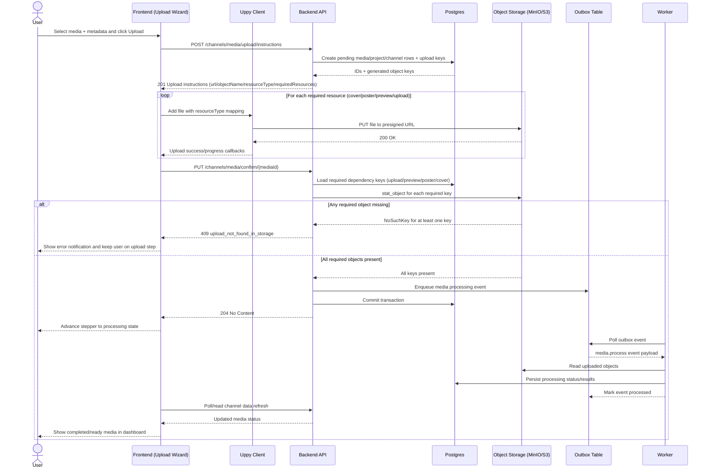

# Upload Flow Sequence Diagram

```mermaid
sequenceDiagram
    actor U as User
    participant FE as Frontend (Upload Wizard)
    participant UPPY as Uppy Client
    participant API as Backend API
    participant DB as Postgres
    participant S3 as Object Storage (MinIO/S3)
    participant OUT as Outbox Table
    participant WRK as Worker

    U->>FE: Select media + metadata and click Upload
    FE->>API: POST /channels/media/upload/instructions
    API->>DB: Create pending media/project/channel rows + upload keys
    DB-->>API: IDs + generated object keys
    API-->>FE: 201 Upload instructions (url/objectName/resourceType/requiredResources)

    loop For each required resource (cover/poster/preview/upload)
        FE->>UPPY: Add file with resourceType mapping
        UPPY->>S3: PUT file to presigned URL
        S3-->>UPPY: 200 OK
        UPPY-->>FE: Upload success/progress callbacks
    end

    FE->>API: PUT /channels/media/confirm/{mediaId}
    API->>DB: Load required dependency keys (upload/preview/poster/cover)
    API->>S3: stat_object for each required key

    alt Any required object missing
        S3-->>API: NoSuchKey for at least one key
        API-->>FE: 409 upload_not_found_in_storage
        FE-->>U: Show error notification and keep user on upload step
    else All required objects present
        S3-->>API: All keys present
        API->>OUT: Enqueue media processing event
        API->>DB: Commit transaction
        API-->>FE: 204 No Content
        FE-->>U: Advance stepper to processing state

        WRK->>OUT: Poll outbox event
        OUT-->>WRK: media.process event payload
        WRK->>S3: Read uploaded objects
        WRK->>DB: Persist processing status/results
        WRK-->>OUT: Mark event processed
        FE->>API: Poll/read channel data refresh
        API-->>FE: Updated media status
        FE-->>U: Show completed/ready media in dashboard
    end
```
